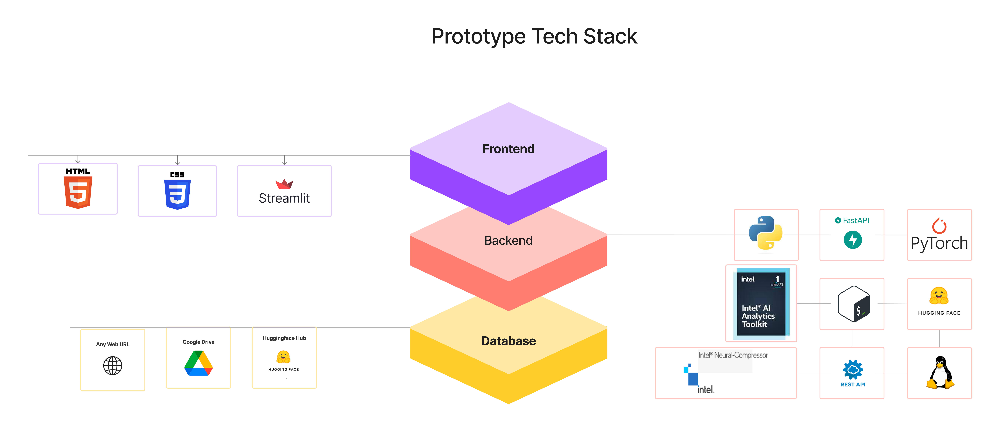

# Intel oneAPI Hackathon: The LLM Challenge
------------------------------------

## How to train and generate result

* Clone this repositry using `git clone https://github.com/ramashisx/oneAPI_hackathon_submission`
* Make sure you have all the files in [data](./data ) directory atleast train.csv, test.csv must be there to start
* To run this project using scripts navigate to [scripts](./scripts )  folder to run using notebooks go to [notebook](./notebooks ) folder
* Note running using scripts is easier to train without waiting a lot of time while training just make sure you have [tmux](https://github.com/tmux/tmux/wiki/Installing) installed in your system.
* To deploy the webapp go to the [webapp](./webapp ) folder
* The blog is there in the [docs](./docs) folder
* Navigate to your preferred folder for further instructions

## Introduction

Welcome to the README for the solution developed for the oneAPI Hackathon: The LLM Challenge. This solution focuses on harnessing the power of Language Models (LLMs) to address the challenge of text understanding and generation for accurate, context-aware answers. The primary goal of this project is to create a robust LLM, and then utilize it effectively within an application. In addition, this README will provide an overview of the steps taken to build the solution, including the tools and technologies used.

## Solution Overview

The challenge at hand required us to leverage Large Language Models (LLMs) for the purpose of generating accurate, context-aware answers. After assessing the problem statement and the available resources, we determined that this was not just an extractive question-answering task but also involved generative question-answering. To tackle this, we decided to fine-tune a T5-based model trained on the Squad v2 dataset.

## Benchmark Results

## Techology used in WebApp and overall project
[Intel® oneAPI AI Analytics Toolkit](https://www.intel.com/content/www/us/en/developer/tools/oneapi/ai-analytics-toolkit-download.html)
-------------------------------

-------------------------------
1. [Intel® Extension for Pytorch](https://github.com/intel/intel-extension-for-pytorch): Used for our Multilingual Extractive QA model Training/Inference optimization.
2. [Intel® Neural Compressor](https://github.com/intel/neural-compressor): Used for  Generative QA model Inference optimization, using quantization and pruning.
---------------------------------

## Building the Solution

1. **Data Analysis**: We began by examining the problem statement and the available data. It was clear that this challenge required both extractive and generative question-answering capabilities. We decided to fine-tune a T5-based model, as it is well-suited for both types of QA tasks.

2. **Fine-Tuning**: Using the Squad v2 dataset, we fine-tuned the T5 model to make it proficient in generating accurate answers for both extractive and generative QA. This involved training the model on relevant data to align it with the requirements of the challenge.

3. **Model Optimization**: Post-fine-tuning, we utilized Intel's Neural Compressor to optimize the trained model. This step included model pruning and quantization to make it more efficient and deployable.

4. **Web Application Development**: To showcase the power of our LLM and allow users to interact with it easily, we developed a web application. This application integrates the model and offers a user-friendly interface for generating answers to text-based queries.

-----------------------------------
# What we learned 

✅ **Utilizing the Intel® AI Analytics Toolkit**: By utilizing the Intel® AI Analytics Toolkit, developers can leverage familiar Python* tools and frameworks to accelerate the entire data science and analytics process on Intel® architecture. This toolkit incorporates oneAPI libraries for optimized low-level computations, ensuring maximum performance from data preprocessing to deep learning and machine learning tasks. Additionally, it facilitates efficient model development through interoperability.

✅ **Seamless Adaptability**: The Intel® AI Analytics Toolkit enables smooth integration with machine learning and deep learning workloads, requiring minimal modifications.
