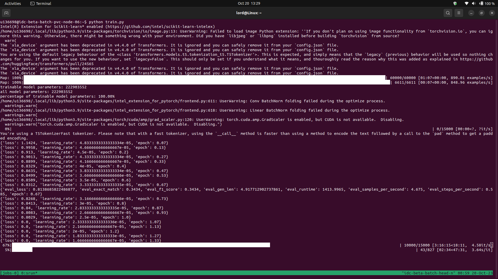

# Instruction on how to run the scripts
-----------------
* ssh into your Intel Dev Cloud Enviornment 
* using tmux is preferred it already installed in your env it makea everything smooth (optional)
* run 'tmux new -t main' this will open a terminal within your dev cloud terminal (optional)
* If not using tmux just simply open your dev cloud terminal 
* run `srun --pty bash`
* run `source /opt/intel/oneapi/setvars.sh`
* run `pip install -r requirnments.txt`
* Let's start training run `python train.py`
* If you using tmux press ctrl+b and then d this will minimise your terminal
* To open again run `tmux a -t main` this resume your terminal without stopping training
* After training is complete navigate your trained model and run `bash run_pruning.sh` and provide trained model path when prompted
* This will use [Intel Neural Compressor]() to prune your model you can a lot of parameter by changing values in [run_pruning.sh]() file
* Navigate your pruned model and let's start Quantization.
* run `bash run_quantization.sh` and provide your pruned model path when prompted.
* This will also use [Intel Neural Compressor]() to quantize your model
* Navigate your final quantized model this might not be the most accurate model but will have the highest throughput.
* Now run `bash generate_submission.sh` provide model of your choice when prompted and it will infer and save results in current folder with name `submission.csv`

# Screenshot showing how training on Intel Dev Cloud

